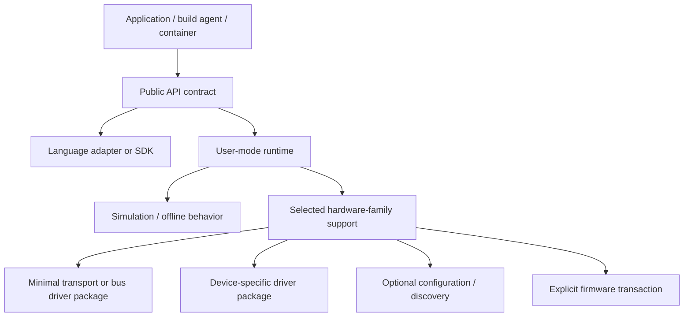

# Driver modernization and API decoupling

**Status:** recommended architecture direction; requires component-owner and Windows-driver validation.

## Decision

Yes: the new model should let a customer install NI APIs, language adapters, build support, examples, simulation, and other user-mode capabilities **without** receiving the entire legacy driver stack.

The constraint is narrower than it first appears: an existing signed Windows driver package cannot be edited, split, or have files removed without invalidating its signature. That does **not** mean future NI driver packages must retain their current size or organization. With source ownership and an approved Windows build/signing pipeline, NI can create new granular driver packages, each with its own INF, catalog, binaries, identity, and signature.

## Target delivery planes



| Plane | Customer value | Default for API/build plan? | Windows constraint |
|---|---|---:|---|
| Public API contract | Compile/link against a stable interface. | Yes | No Driver Store change. |
| SDK/language adapter | LabVIEW, C/C++, .NET, Python support. | Selected language only | No driver required merely to install. |
| User-mode runtime | Load APIs, use simulation, defer device access. | Yes where validated | Must state behavior when no driver/device exists. |
| Hardware-family support | DAQ USB/PCIe/PXI, CompactDAQ, instrument family behavior. | No | Selected by capability/hardware family. |
| Transport/kernel driver | PnP binding and kernel access. | No | Original signed package reused intact, or a newly built/signed package. |
| Device-specific driver/personality | Exact hardware IDs and device behavior. | No | Separate package only when safe ownership/PnP boundaries exist. |
| Configuration/discovery | MAX/device-monitor/service/schema. | No | Explicit singleton service/schema policy. |
| Firmware | Device image/update tools. | Never | Explicit device transaction and recovery policy. |

## What can be compartmentalized immediately

The first POC catalog should make these selectable without a driver:

- API contract and headers/import libraries;
- C, .NET, Python, and LabVIEW adapters keyed to the selected ABI/release;
- non-privileged user-mode runtime where load/simulation behavior is validated;
- documentation, examples, and offline help;
- build integrations and compiler/tooling support.

An API-only plan must prove that it does not stage a Driver Store package, bind PnP hardware, start a driver service, install firmware, or write hardware configuration. First real I/O without a selected hardware pack should return a clear missing-capability result—not silently install a broad stack.

## How to modernize a legacy driver stack

1. **Map actual ownership.** Use source/build ownership, INF hardware IDs, driver service ownership, runtime call tracing, and clean-machine tests—not legacy product names or directories.
2. **Define stable user/kernel contracts.** Keep public API/runtime ABI separate from internal transport and device-driver contracts. Version each deliberately.
3. **Create new package units.** For each safe boundary, build a new INF/CAT/SYS package from source, with a minimal intended hardware-ID set and no unrelated user-mode payload.
4. **Sign each new package.** Generate a new catalog and obtain the required Windows driver signing. Never edit a legacy signed package to simulate this split.
5. **Model shared/singleton resources.** A driver service, filter, bus enumerator, or shared configuration schema may force a larger singleton upgrade domain. The catalog must expose that fact rather than hide it.
6. **Prove lifecycle behavior.** Validate clean install, PnP binding, multiple device families, upgrade/downgrade, unplug/replug, reboot, repair, rollback, removal, Secure Boot/code integrity, and interruption recovery.
7. **Publish the component contract.** Each driver/build team emits component metadata, original or new signature/provenance, hardware matching, resource claims, restart behavior, rollback, and compatibility ranges.

## Granularity rule

Do not split a driver merely to make package counts smaller. Split at a real independent activation and servicing boundary:

- a USB transport driver shared by multiple supported USB DAQ families may remain one package;
- a PXI bus/platform driver may be distinct from an instrument-specific user-mode personality;
- a device-specific PnP driver can be separate if it does not share an inseparable service/filter/configuration schema;
- shared bus filters, device enumerators, and singleton services must remain declared singleton domains until source and lifecycle testing establish a safer boundary.

The desired measure is the smallest compatible **change closure**, not the largest number of archives.

## Required component metadata

For any hardware/driver component, the build output must add:

```json
{
  "role": "device-driver",
  "hardwareFamily": "usb-daq",
  "hardwareIds": ["PCI\\VEN_....", "USB\\VID_...."],
  "upgradeDomain": "daqmx-usb-kernel",
  "coexistencePolicy": "singleton",
  "requiresExplicitBoundary": true,
  "driverPackage": {
    "origin": "legacy-original-signed | newly-built-signed",
    "inf": "ni-usb-daq.inf",
    "catalogDigest": "sha256:...",
    "signingIdentity": "..."
  },
  "userModeCompatibility": ">=26.0 <27.0",
  "rollbackPolicy": "validated-driver-rollback-plan"
}
```

## POC success criteria

The first demonstration should show all of the following separately:

1. A clean build/API plan installs no driver artifacts.
2. A compatible user-mode plan loads and performs its declared simulation/offline health check with no device support.
3. Selecting one device family adds only its matching hardware/driver closure.
4. A driver update retains a compatible API/runtime and unrelated device-family drivers.
5. A runtime/API update does not touch drivers or firmware unless an explicit compatibility rule requires it.
6. Firmware remains deselected and cannot be activated as an incidental driver update.

No current reference-machine inventory proves these points. It identifies the candidate packages and staged Driver Store state needed to begin the work; source ownership and clean-machine hardware validation are required before the behavior is supported.

## Proof-of-concept signing boundary

An unsigned kernel-mode driver cannot be installed on a normal clean Windows 11 x64 machine with standard code-integrity enforcement. Therefore the clean-machine success criterion must not depend on bypassing driver-signing policy, disabling Secure Boot, or placing a customer machine in test-signing mode.

The prototype has two deliberately separate proof modes:

| Mode | What it proves | Driver behavior | Eligible for the clean-machine demonstration? |
|---|---|---|---:|
| Component-installer POC | New catalog, API-only delivery, offline bundle creation, plan/upgrade isolation, and explicit driver activation UX. | A mock driver executor records/stages a declarative driver plan but does not bind a kernel driver. | Yes, for all non-driver capabilities. |
| Isolated driver-lab POC | New INF/package boundaries, PnP selection, service ownership, and rollback mechanics. | Only a newly built **test-signed** driver package on a disposable dedicated VM/lab machine under explicit test policy. | No. |
| Production-capable driver package | Actual hardware operation on supported customer Windows configurations. | Newly built package signed through the approved production Windows driver-signing path, or an intact existing signed package. | Yes. |

Test signing is useful only to accelerate engineering feedback on a disposable lab VM. It must be explicit in the catalog (`signingMode: test-only`), rejected by the normal installer/channel policy, and never included in an offline bundle intended for customer systems. The test VM configuration, test certificate, and any required boot/security policy changes are test-lab state—not product behavior and not part of this POC's clean-machine success criterion.

The first functional installer demonstration should therefore prove API/runtime installation and component planning end-to-end while using a mock driver activation boundary. It should then accept an actual production-signed legacy driver package or a newly production-signed redesign package for the hardware-validation phase. This preserves the driver redesign architecture without weakening Windows code-integrity protections.