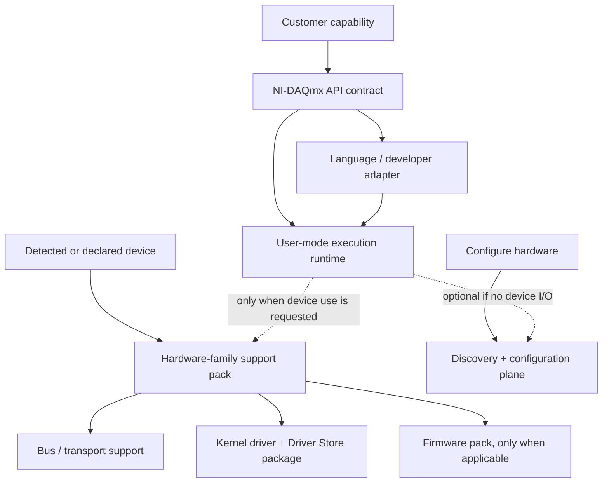

# NI-DAQmx cut-point hypothesis

**Status:** evidence-informed design hypothesis. The current NI Package Manager boundaries are useful discovery evidence, but they are not yet the future delivery boundaries.

## Answer

There is enough evidence to define and prototype the **first cut points**. There is not yet enough evidence to certify that an API-only package will work without any kernel, service, configuration, or device dependency across the supported NI-DAQmx portfolio.

The needed next step is not further naming analysis. It is a per-device, per-API, per-LabVIEW-version execution matrix plus file/resource ownership tracing that proves which runtime calls require which privileged resources.

## What the Windows reference machine proves

Detailed NI Package Manager metadata for 64-bit NI-DAQmx 2026 Q1 already exposes meaningful package candidates:

| Existing package | Observed purpose | Observed size | Candidate future role | Current boundary suitable as-is? |
|---|---|---:|---|---|
| `ni-daqmx-runtime-core` | “Run-time components required to deploy applications using NI data acquisition devices.” | 124 MB | Starting point for user-mode core; must be split after resource tracing | No — it depends on platform, routing, discovery, crypto, and service-related packages. |
| `ni-daqmx-26.0.0-dotnet-fx40-runtime` / `fx45-runtime` | .NET language runtime support | ~1.6 MB each | Language-binding packages | Nearly — retain only matching runtime/framework dependencies. |
| `ni-daqmx-c-support` | C development support | not yet measured | SDK/developer package | Likely separable from runtime and device packs. |
| `ni-daqmx-labview-support` | API, docs, examples for LabVIEW | not yet measured | LabVIEW adapter package, keyed by supported LabVIEW ABI/version | Likely separable, but must be verified per LabVIEW release/architecture. |
| `ni-daqmx-config-support-core` | MAX configuration support | not yet measured | Configuration/discovery plane | Separate from build/CI and potentially from normal application execution. |
| `ni-daqmx-devmon-support` | NI Device Monitor support | 0.4 MB | Device discovery/notification integration | Optional unless a selected customer capability requires it. |
| `ni-daqmx-cdaq-firmware` | Ethernet CompactDAQ, FieldDAQ, and NI Linux RT CompactDAQ firmware | 240 MB | Hardware-family firmware pack | Definitely separate; never download/install by default for API-only users. |
| `ni-daqmx-common-docs` | Common user documents | 11 MB | Documentation | Optional and independently removable. |

The current `ni-daqmx` resolution also includes shared NI platform packages, Microsoft Visual C++ and .NET runtimes, PXI platform/routing packages, and device-related services. Therefore an existing package dependency must not be relabeled “API-only” without identifying which exact files and runtime call paths cause those edges.

## Proposed delivery model



### 1. API contract package

Provides stable C ABI/API metadata and contract versioning. It contains no device-specific drivers, Driver Store packages, services, firmware, MAX configuration, or hardware discovery.

### 2. Language and developer adapters

Separate packages for at least:

- LabVIEW adapter, keyed by LabVIEW release/ABI and x64/x86 role;
- C/C++ headers, import libraries, examples, and build integration;
- .NET adapter, keyed by target framework and binding ABI;
- Python adapter, keyed by Python ABI/package distribution strategy;
- documentation/examples.

A build agent should resolve only the API contract plus its required language adapter and any compiler/runtime prerequisite. It should not receive hardware support by implication.

### 3. User-mode execution runtime

Contains the non-privileged libraries required to load and execute an application that targets the declared DAQmx API. It may be usable without hardware for simulation, compilation, static checks, help/examples, or applications whose hardware access is deferred.

This package must declare its behavior plainly:

- `loads_without_hardware: true|false`;
- `supports_simulation: true|false`;
- `requires_device_pack_for_first_io: true|false`;
- `container_eligible: true|false`;
- `host_driver_compatibility_range`, where container/user-mode use is supported.

### 4. Hardware-family support pack

A customer selects this indirectly through detected PnP hardware IDs or an explicit hardware family. Examples must be catalogued as separate families: USB DAQ, PCI/PXI DAQ, CompactDAQ, Ethernet CompactDAQ, FieldDAQ, RIO-based devices, legacy DAQ families, and any other supported DAQmx hardware grouping.

It owns the device-specific user-mode personality, device match rules, hardware-specific services, and compatibility constraints. It depends on the user-mode runtime but is not pulled into a build-only plan.

### 5. Bus/transport and kernel activation pack

This is a Windows-only privileged plane. It owns original signed INF/CAT/SYS payloads, Driver Store staging, PnP binding, driver service activation, kernel compatibility, restart requirements, and rollback state. It must never be recreated by copying files.

A device pack may depend on zero or more bus packs, such as PCIe/PXI, USB, Ethernet discovery, serial, or network transport. The actual boundary must follow observed INF hardware IDs and shared kernel/service ownership—not marketing names.

### 6. Firmware pack

Firmware must be independently selected by hardware match and current/target firmware compatibility. Its transaction must capture device identity, current version, power/interruption policy, verification, and recovery. The observed CompactDAQ firmware package is already large enough to justify this separation.

### 7. Configuration and discovery plane

MAX/NI Hardware Configuration Utility, Device Monitor, device enumeration, naming, calibration, and configuration schema are separate capabilities. They may be included in a workstation profile, but they are not prerequisites for CI/build agents. Any configuration service or database must have an explicit schema owner and migration policy.

## Compatibility model

The key compatibility unit is not “NI-DAQmx 26.0.” It is a tuple:

$$
(\text{DAQmx API ABI},\ \text{language adapter ABI},\ \text{user runtime},\ \text{hardware family},\ \text{driver/firmware},\ \text{OS kernel},\ \text{LabVIEW ABI})
$$

Each delivery component needs a version range for every relevant boundary. For example, a LabVIEW adapter should be modeled as:

```yaml
component: daqmx-labview-adapter
requires:
  - daqmx-api-abi: ">=26.0 <27.0"
  - labview-abi: "2026-q1-x64"
provides:
  - labview.palette.daqmx
  - labview.vis.daqmx
forbids:
  - labview-abi: "2025-q3-x86" # unless a separately built compatibility adapter exists
```

Avoid the current failure mode in which a broad driver/version rule quietly installs every LabVIEW integration and every hardware payload.

## What must be measured before the cut points become supported

For a representative device from each hardware family, run a clean-VM/physical-host matrix that proves:

1. compilation succeeds using C, .NET, Python, and each supported LabVIEW version with only the selected developer adapter;
2. an API-only runtime loads without any Driver Store changes, NI driver services, or configuration services;
3. each first hardware I/O call fails with a clear, actionable missing-capability result when its device pack is absent;
4. adding exactly one matching device pack stages/binds only the required signed driver resources;
5. simulated-device, discovery, configuration, calibration, and firmware workflows each activate only their stated planes;
6. updates preserve API ABI and do not update a driver/firmware component unless its compatibility rule requires it;
7. removal of a language adapter, docs, or a non-selected hardware pack cannot break another installed device family.

## Immediate inventory work

The next read-only collection should map NI-DAQmx package contents to resource claims:

- NIPKG package manifests/file lists, control attributes, and full dependency/recommendation/provides/conflicts metadata;
- Driver Store INF → hardware IDs → catalog/SYS files → installed package mapping;
- services and their binary/configuration ownership;
- registry/configuration entries by package install/upgrade traces in disposable VMs;
- runtime dependency tracing for a small C, .NET, Python, and LabVIEW sample that performs load-only, simulation, discovery, and real-device I/O actions.

The current reference machine has NI-DAQmx package and Driver Store evidence but does not have representative DAQ hardware attached. It can identify staged payload and shared-resource topology, but a second reference target with each actual device family is required to validate PnP bindings and minimal device packs.
